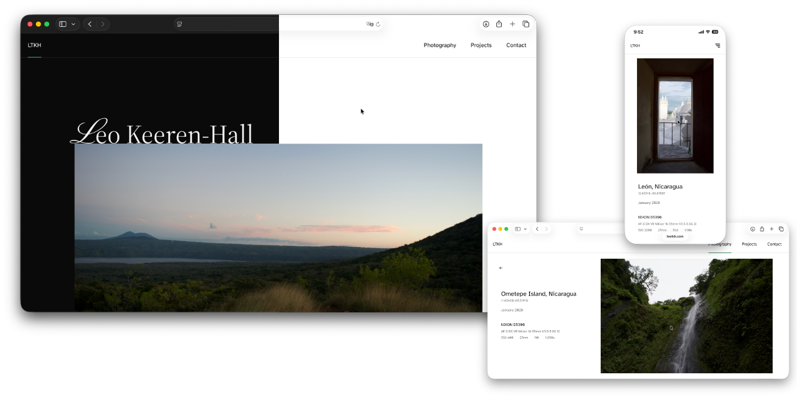

# Personal Website Landing Page



A personal portfolio and photography website built with Flask, Frozen-Flask, and Tailwind CSS.

The site is designed around a minimal editorial layout focused on typography, spacing, and structure rather than heavy UI components. It combines technical projects, photography, and CV information into a single static site.

---

## Stack

- Python
- Flask
- Frozen-Flask
- Tailwind CSS
- HTML / Jinja

---

## Features

- Static site generation
- Responsive layout
- Dark mode
- Photography gallery with lightbox
- Project archive
- Dynamic meta tags for sharing
- Image optimization pipeline

---

## Development

Run Flask:

```bash
python3 app.py
```

Run Tailwind watcher:

```bash
npm run dev
```

Build static site:

```bash
python app.py
```

---

## Structure

```txt
/app.py
/templates
/static
```